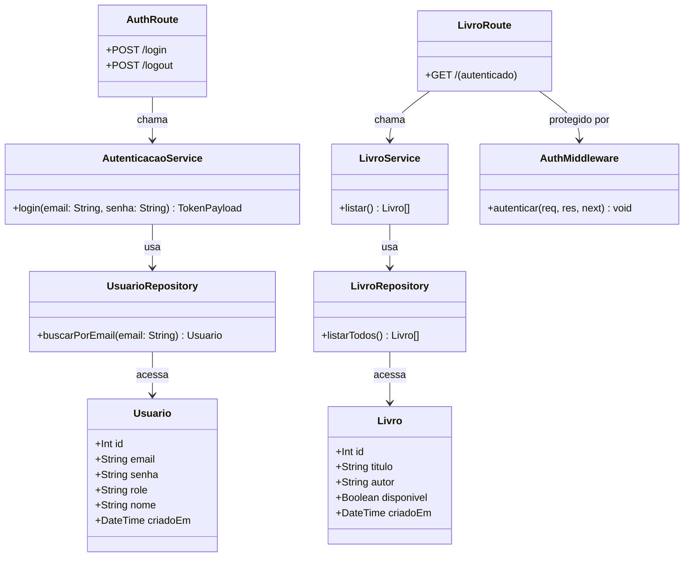
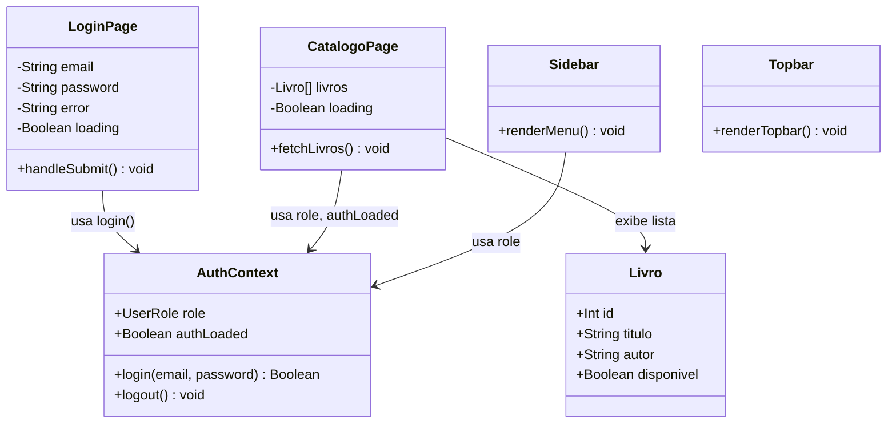
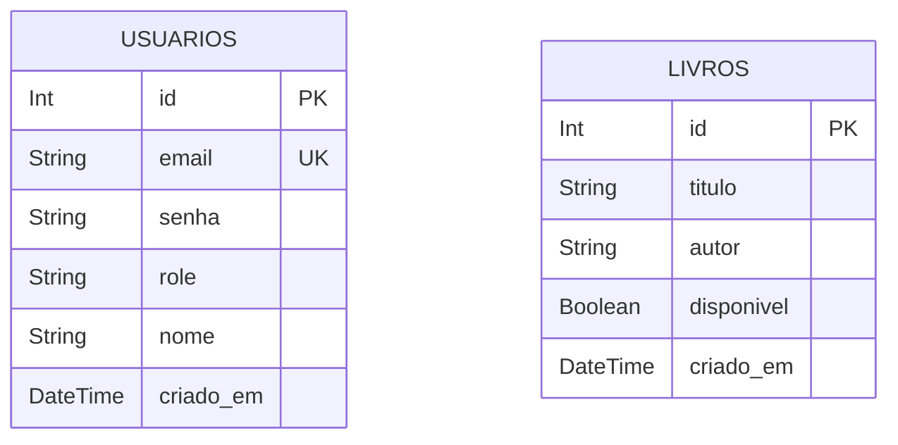

# Diagrama de Classes e Relacionamentos

Representação das classes do sistema, seus atributos, métodos e relacionamentos — alinhado aos CRC Cards da Semana 2.

---

## Diagrama de Classes (Backend)



---

## Diagrama de Classes (Frontend)



---

## Diagrama de Entidades (Banco de Dados)



> **Nota:** Na Semana 2 as entidades ainda são independentes. A tabela de `RESERVAS` (com FK para `USUARIOS` e `LIVROS`) está planejada para a Semana 3.

---

## Relacionamento entre Camadas

```
┌──────────────────────────────────────────────────┐
│                   FRONTEND (Next.js)              │
│  LoginPage ──▶ AuthContext ──▶ POST /api/auth/login│
│  CatalogoPage ──▶ GET /api/livros (Bearer token)  │
└────────────────────────┬─────────────────────────┘
                         │ HTTP (REST + JWT)
┌────────────────────────▼─────────────────────────┐
│                   BACKEND (Express)               │
│  Route ──▶ Middleware(JWT) ──▶ Service ──▶ Repo  │
└────────────────────────┬─────────────────────────┘
                         │ Prisma ORM
┌────────────────────────▼─────────────────────────┐
│              BANCO DE DADOS (SQLite / PostgreSQL)  │
│  tabla: usuarios          tabela: livros           │
└──────────────────────────────────────────────────┘
```
